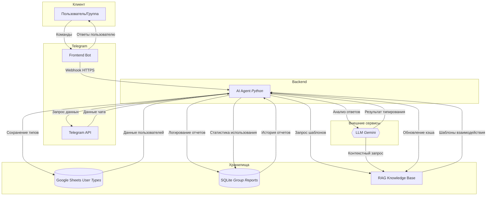

```mermaid
graph TD
    subgraph "Клиент"
        A[Пользователь/Группа]
    end

    subgraph "Telegram"
        B[Frontend Bot]
        I[Telegram API]
    end

    subgraph "Backend"
        D[AI Agent <i>Python</i>]
    end

    subgraph "Хранилища"
        E[(Google Sheets <i>User Types</i>)]
        F[(SQLite <i>Group Reports</i>)]
        J[RAG Knowledge Base]
    end

    subgraph "Внешние сервисы"
        G{{LLM <i>Gemini</i>}}
    end

    %% Прямые связи
    A -- Команды --> B
    B -- Webhook HTTPS --> D
    D -- Запрос данных --> I
    D -- Запрос шаблонов --> J
    D -- Анализ ответов --> G
    D -- Сохранение типов --> E
    D -- Логирование отчетов --> F
    G -- Контекстный запрос --> J
    
    %% Обратные связи (ответы)
    B -- Ответы пользователю --> A
    I -- Данные чата --> D
    J -- Шаблоны взаимодействия --> D
    G -- Результат типирования --> D
    E -- Данные пользователей --> D
    F -- История отчетов --> D
    
    %% Дополнительные связи
    D -- Обновление кэша --> J
    D -- Статистика использования --> F
```
