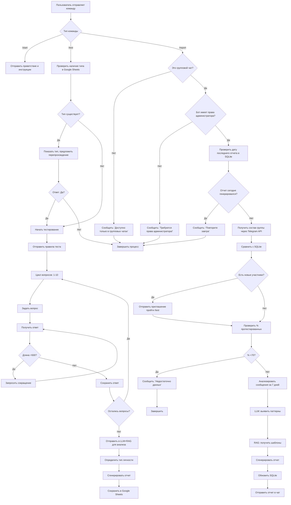

```mermaid
graph TD
    A[Пользователь отправляет команду] --> B{Тип команды}
    B -->|/start| C[Отправить приветствие и инструкции]
    B -->|/test| D[Проверить наличие типа в Google Sheets]
    B -->|/report| E{Это групповой чат?}
    
    %% /test branch 
    D --> F{Тип существует?}
    F -->|Да| G[Показать тип, предложить перепрохождение]
    G --> H{Ответ: Да?}
    H -->|Да| I[Начать тестирование]
    H -->|Нет| J[Завершить процесс]
    F -->|Нет| I
    
    I --> K[Отправить правила теста]
    K --> L[Цикл вопросов: 1-10]
    L --> M[Задать вопрос]
    M --> N[Получить ответ]
    N --> O{Длина >500?}
    O -->|Да| P[Запросить сокращение] --> N
    O -->|Нет| Q[Сохранить ответ]
    Q --> R{Остались вопросы?}
    R -->|Да| L
    R -->|Нет| S[Отправить в LLM+RAG для анализа]
    S --> T[Определить тип личности]
    T --> U[Сгенерировать отчет]
    U --> V[Сохранить в Google Sheets]
    
    %% /report branch
    E -->|Нет| E1[Сообщить: 'Доступно только в групповых чатах'] --> J
    E -->|Да| E2{Бот имеет права администратора?}
    E2 -->|Нет| E3[Сообщить: 'Требуются права администратора!'] --> J
    E2 -->|Да| E4[Проверить дату последнего отчета в SQLite]
    E4 --> W{Отчет сегодня генерировался?}
    W -->|Да| X[Сообщить: 'Повторите завтра'] --> J
    W -->|Нет| Z[Получить состав группы через Telegram API]
    Z --> AA[Сравнить с SQLite]
    AA --> AB{Есть новые участники?}
    AB -->|Да| AC[Отправить приглашение пройти /test]
    AB -->|Нет| AD[Проверить % протестированных]
    AC --> AD
    
    AD --> AE{% <70?}
    AE -->|Да| AF[Сообщить: 'Недостаточно данных'] --> AG[Завершить]
    AE -->|Нет| AH[Анализировать сообщения за 7 дней]
    AH --> AI[LLM: выявить паттерны]
    AI --> AJ[RAG: получить шаблоны]
    AJ --> AK[Сгенерировать отчет]
    AK --> AL[Обновить SQLite]
    AL --> AM[Отправить отчет в чат]
    
```
