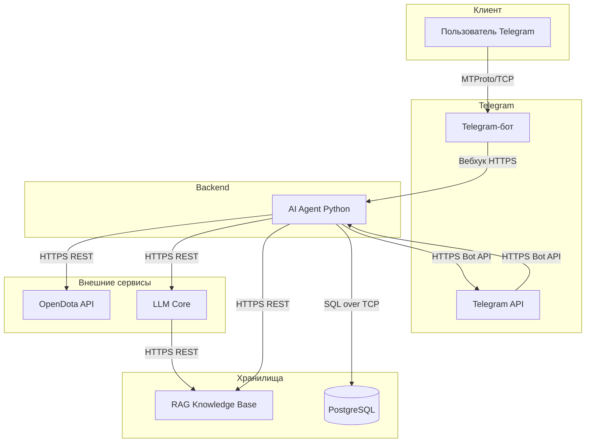

```mermaid
graph TD
    subgraph "Клиент"
        A[Пользователь Telegram] 
    end

    subgraph "Telegram"
        B[Telegram-бот]
        I[Telegram API]
    end

    subgraph "Backend"
        D[AI Agent Python]
    end

    subgraph "Хранилища"
        J[RAG Knowledge Base]
        P[(PostgreSQL)]
    end

    subgraph "Внешние сервисы"
        O[OpenDota API]
        L[LLM Core]
    end

    A -- MTProto/TCP --> B
    B -- Вебхук HTTPS --> D
    D -- HTTPS REST --> O
    D -- HTTPS REST --> L
    D -- HTTPS REST --> J
    D -- SQL over TCP --> P
    L -- HTTPS REST --> J
    D -- HTTPS Bot API --> I
    I -- HTTPS Bot API --> D
```
