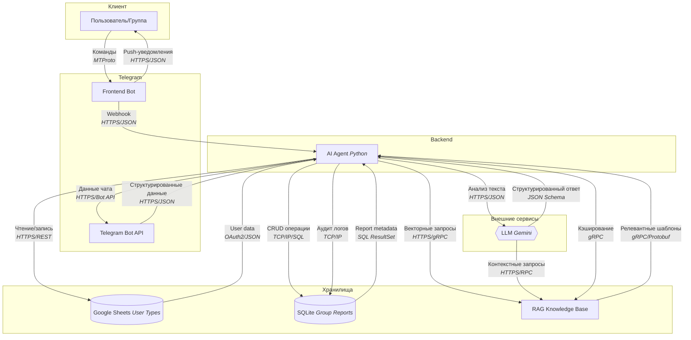

```mermaid
graph TD
    subgraph "Клиент"
        A[Пользователь/Группа]
    end

    subgraph "Telegram"
        B[Frontend Bot]
        I[Telegram Bot API]
    end

    subgraph "Backend"
        D[AI Agent <i>Python</i>]
    end

    subgraph "Хранилища"
        E[(Google Sheets <i>User Types</i>)]
        F[(SQLite <i>Group Reports</i>)]
        J[RAG Knowledge Base<br>]
    end

    subgraph "Внешние сервисы"
        G{{LLM <i>Gemini</i>}}
    end

    %% Прямые связи с протоколами
    A -- Команды<br><i>MTProto</i> --> B
    B -- Webhook<br><i>HTTPS/JSON</i> --> D
    D -- Чтение/запись<br><i>HTTPS/REST</i> --> E
    D -- CRUD операции<br><i>TCP/IP/SQL</i> --> F
    D -- Векторные запросы<br><i>HTTPS/gRPC</i> --> J
    D -- Анализ текста<br><i>HTTPS/JSON</i> --> G
    D -- Данные чата<br><i>HTTPS/Bot API</i> --> I
    G -- Контекстные запросы<br><i>HTTPS/RPC</i> --> J
    
    %% Обратные связи с протоколами
    B -- Push-уведомления<br><i>HTTPS/JSON</i> --> A
    I -- Структурированные данные<br><i>HTTPS/JSON</i> --> D
    J -- Релевантные шаблоны<br><i>gRPC/Protobuf</i> --> D
    G -- Структурированный ответ<br><i>JSON Schema</i> --> D
    E -- User data<br><i>OAuth2/JSON</i> --> D
    F -- Report metadata<br><i>SQL ResultSet</i> --> D
    
    %% Дополнительные связи
    D -- Кэширование<br><i>gRPC</i> --> J
    D -- Аудит логов<br><i>TCP/IP</i> --> F
```
