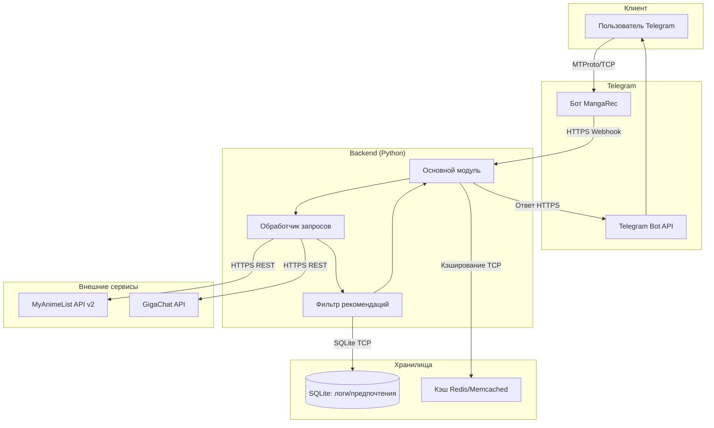

```mermaid
graph TD
    subgraph "Клиент"
        A[Пользователь Telegram]
    end
    
    subgraph "Telegram"
        B[Бот MangaRec]
        I[Telegram Bot API]
    end
    
    subgraph "Backend (Python)"
        D[Основной модуль]
        E[Обработчик запросов]
        F[Фильтр рекомендаций]
    end
    
    subgraph "Хранилища"
        S[(SQLite: логи/предпочтения)]
        C[Кэш Redis/Memcached]
    end
    
    subgraph "Внешние сервисы"
        M[MyAnimeList API v2]
        G[GigaChat API]
    end

    A -- MTProto/TCP --> B
    B -- HTTPS Webhook --> D
    D --> E
    E -- HTTPS REST --> M
    E -- HTTPS REST --> G
    F -- SQLite TCP --> S
    D -- Ответ HTTPS --> I
    I --> A
    
    %% Внутренние связи
    E --> F
    F --> D
    D -- Кэширование TCP --> C
```
