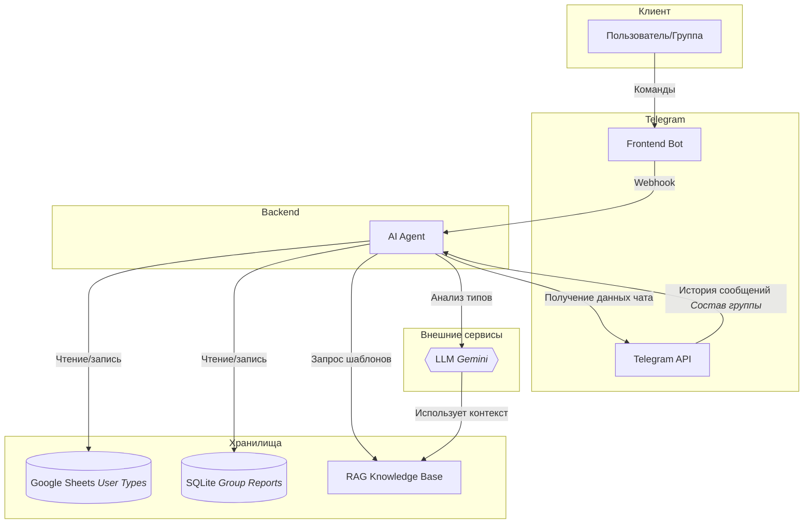

```mermaid
graph TD
    subgraph "Клиент"
        A[Пользователь/Группа]
    end

    subgraph "Telegram"
        B[Frontend Bot]
        I[Telegram API]
    end

    subgraph "Backend"
        D[AI Agent]
    end

    subgraph "Хранилища"
        E[(Google Sheets <i>User Types</i>)]
        F[(SQLite <i>Group Reports</i>)]
        J[RAG Knowledge Base]
    end

    subgraph "Внешние сервисы"
        G{{LLM <i>Gemini</i>}}
    end

    A -- Команды --> B
    B -- Webhook --> D
    D -- Чтение/запись --> E
    D -- Чтение/запись --> F
    D -- Запрос шаблонов --> J
    D -- Анализ типов --> G
    D -- Получение данных чата --> I
    G -- Использует контекст --> J
    I -- История сообщений <i>Состав группы</i> --> D
```
