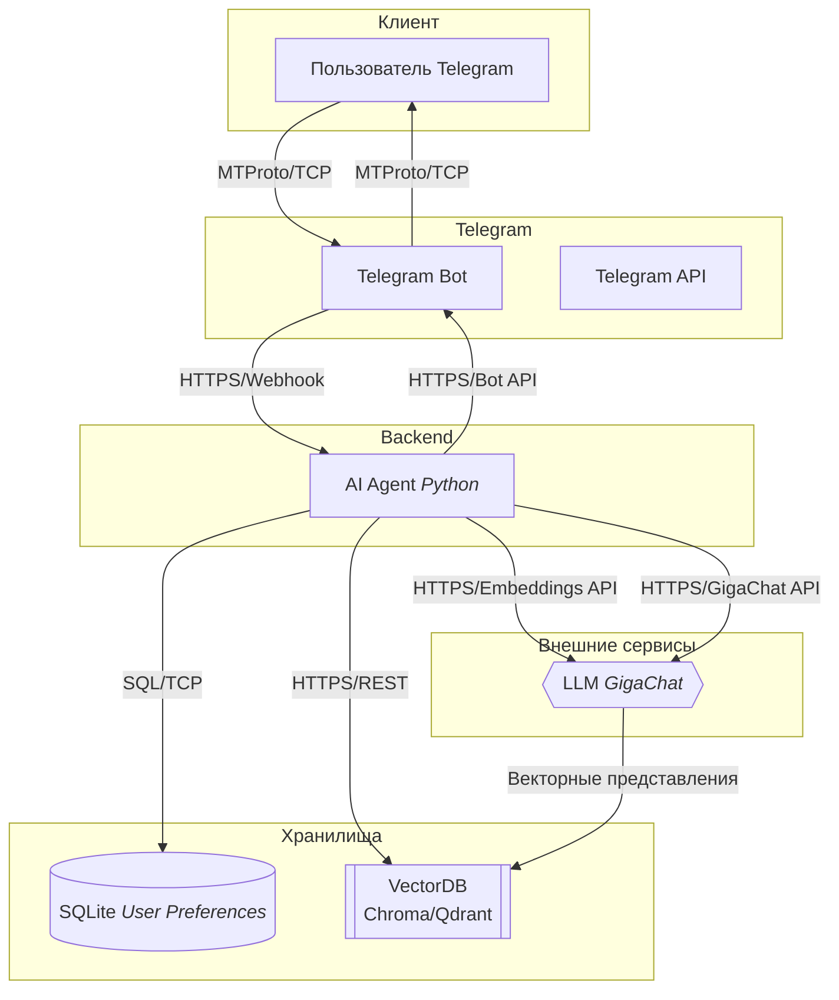

```mermaid
graph TD
    subgraph "Клиент"
        A[Пользователь Telegram]
    end

    subgraph "Telegram"
        B[Telegram Bot]
        I[Telegram API]
    end

    subgraph "Backend"
        D[AI Agent <i>Python</i>]
    end

    subgraph "Хранилища"
        F[(SQLite <i>User Preferences</i>)]
        J[["VectorDB <br/>Chroma/Qdrant"]]
    end

    subgraph "Внешние сервисы"
        G{{LLM <i>GigaChat</i>}}
    end

    A -- "MTProto/TCP" --> B
    B -- "HTTPS/Webhook" --> D
    D -- "SQL/TCP" --> F
    D -- "HTTPS/REST" --> J
    D -- "HTTPS/Embeddings API" --> G
    D -- "HTTPS/GigaChat API" --> G
    G -- "Векторные представления" --> J
    D -- "HTTPS/Bot API" --> B
    B -- "MTProto/TCP" --> A
```
