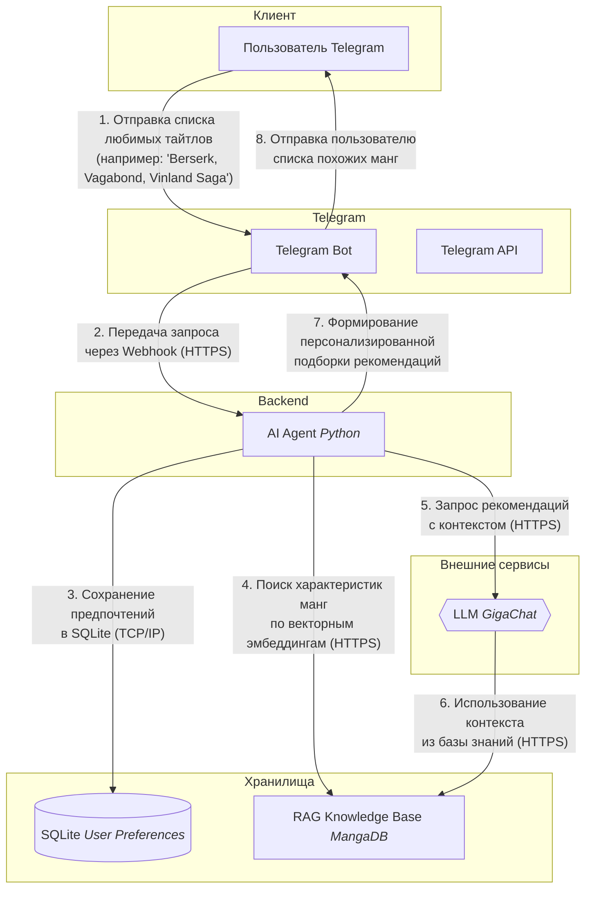

```mermaid
graph TD
    subgraph "Клиент"
        A[Пользователь Telegram]
    end

    subgraph "Telegram"
        B[Telegram Bot]
        I[Telegram API]
    end

    subgraph "Backend"
        D[AI Agent <i>Python</i>]
    end

    subgraph "Хранилища"
        F[(SQLite <i>User Preferences</i>)]
        J[RAG Knowledge Base <i>MangaDB</i>]
    end

    subgraph "Внешние сервисы"
        G{{LLM <i>GigaChat</i>}}
    end

    A -- 1. Отправка списка любимых тайтлов\n(например: 'Berserk, Vagabond, Vinland Saga') --> B
    B -- 2. Передача запроса через Webhook (HTTPS) --> D
    D -- 3. Сохранение предпочтений\nв SQLite (TCP/IP) --> F
    D -- 4. Поиск характеристик манг\nпо векторным эмбеддингам (HTTPS) --> J
    D -- 5. Запрос рекомендаций\nс контекстом (HTTPS) --> G
    G -- 6. Использование контекста\nиз базы знаний (HTTPS) --> J
    D -- 7. Формирование персонализированной\nподборки рекомендаций --> B
    B -- 8. Отправка пользователю\nсписка похожих манг --> A
```
